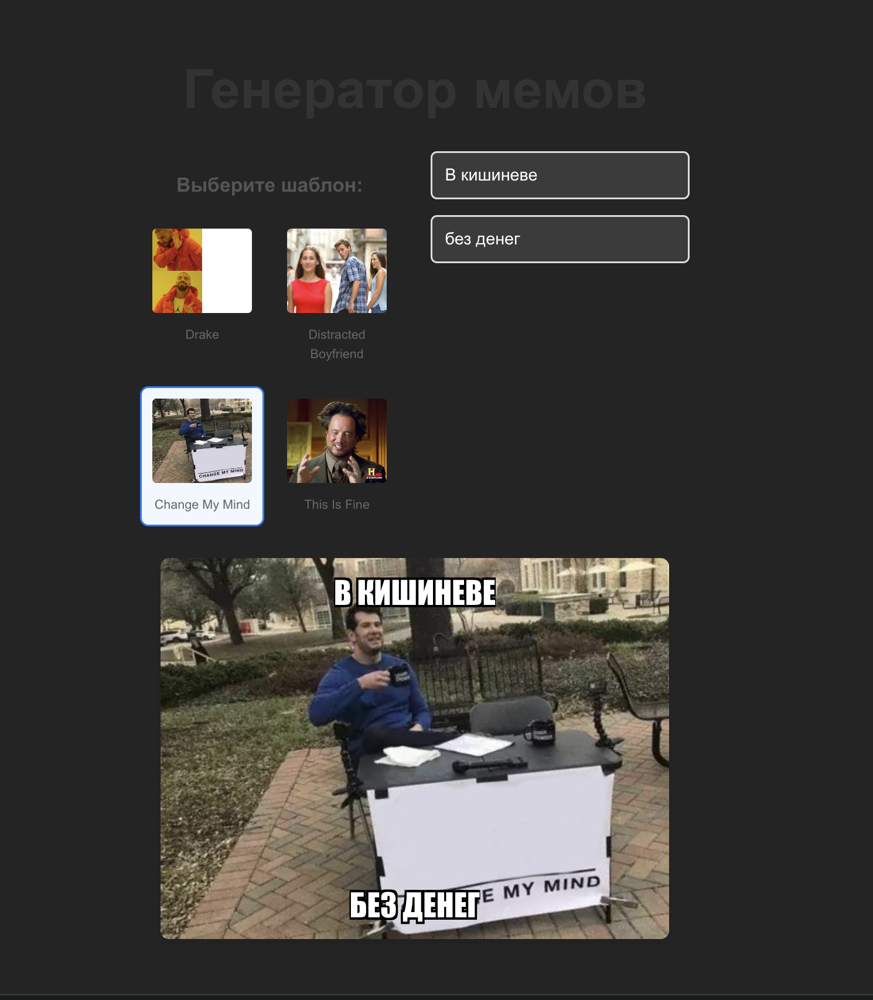
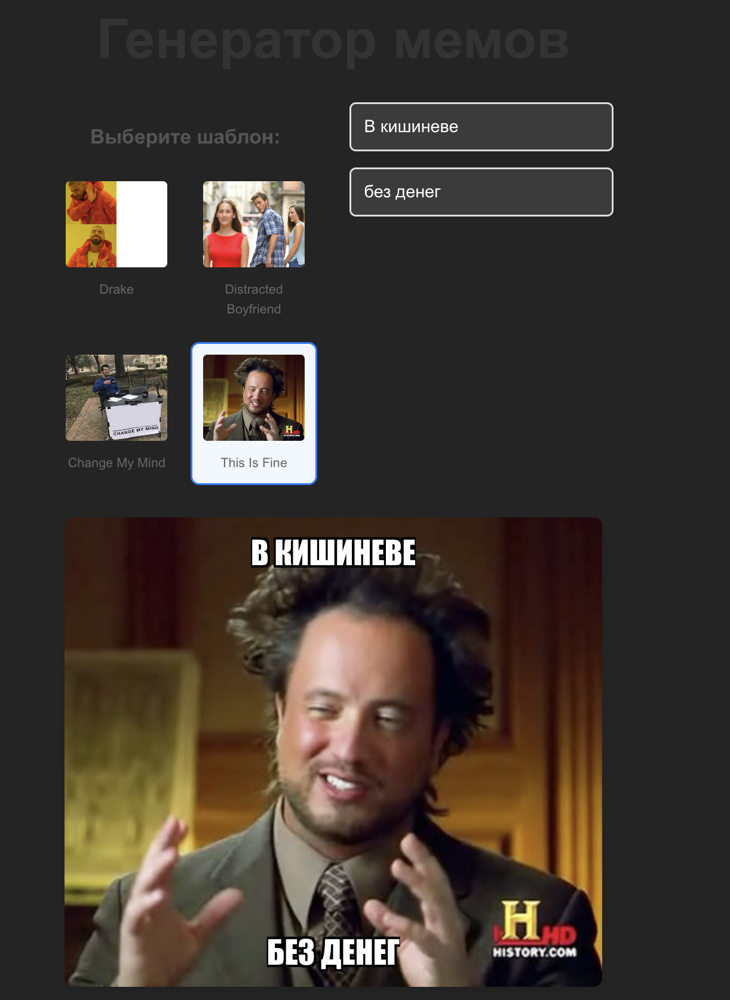

# Генератор мемов

Простое веб-приложение для создания мемов на React + Vite.

## Скриншоты




## Функциональность

- **Выбор шаблонов**: 4 популярных мем-шаблона (Drake, Distracted Boyfriend, Change My Mind, This Is Fine)
- **Редактирование текста**: Добавление верхнего и нижнего текста
- **Предварительный просмотр**: Мгновенное отображение изменений
- **Адаптивный дизайн**: Поддержка мобильных устройств

## Технологии

- **React** - UI библиотека
- **Vite** - Сборщик и dev-сервер
- **CSS3** - Стилизация и адаптивность

## Установка и запуск

1. Клонируйте репозиторий:
```bash
git clone https://github.com/m1yamoto11/TIP.git
cd TIP
```

2. Установите зависимости:
```bash
npm install
```

3. Запустите проект в режиме разработки:
```bash
npm run dev
```

4. Откройте [http://localhost:5173](http://localhost:5173) в браузере

## Сборка для продакшена

```bash
npm run build
```

## Структура проекта

```
src/
│   ├── MemeGenerator.jsx    # Основной компонент генератора
│   └── MemeGenerator.css    # Стили для генератора
├── App.jsx                  # Главный компонент приложения
└── main.jsx                # Точка входа
├── components/
```

## Возможности для развития

- Добавление загрузки собственных изображений
- Сохранение мемов в виде файлов
- Больше шаблонов мемов
- Настройка шрифтов и цветов текста
- Социальный шеринг
